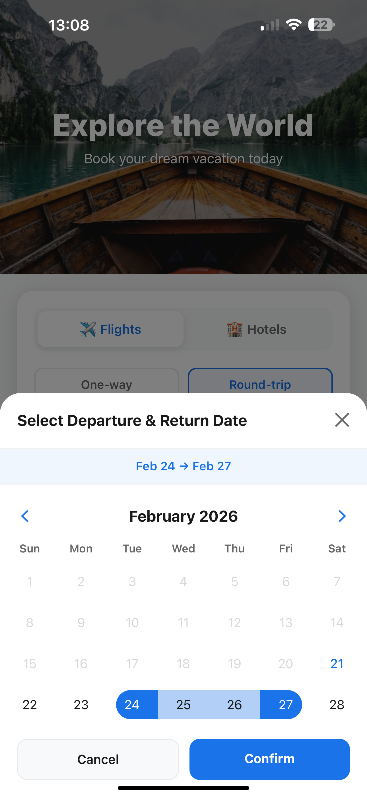
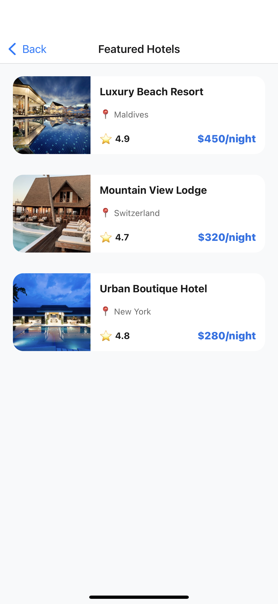
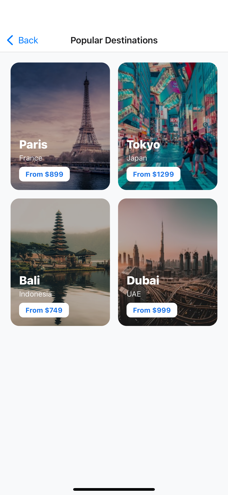

# 🌍 Travel Booking App - React Native + TypeScript

A modern, full-featured travel booking mobile application built with React Native, Expo Router, and TypeScript. Search flights, browse destinations, and book hotels with a beautiful, intuitive interface.

## ✨ Features

### 🎯 Core Functionality
- **Flight Search**
  - One-way and round-trip options
  - Smart city autocomplete with airport codes
  - Date range picker for round-trip flights
  - Real-time search results with loading animations

- **Hotel Search**
  - Destination autocomplete
  - Check-in/check-out date range picker
  - Automatic night calculation
  - Comprehensive hotel listings

- **Browse & Discover**
  - Popular destinations carousel
  - Featured hotels gallery
  - "See All" pages with grid/list layouts
  - Professional card designs

### 🎨 UI/UX Features
- **Smooth Animations**
  - Animated airplane for flight search
  - Pulsing hotel icon for hotel search
  - Professional loading screens
  - Smooth transitions and interactions

- **Date Pickers**
  - Single date selection for one-way flights
  - Date range selection for round-trips and hotels
  - Visual range highlighting
  - Minimum date validation (no past dates)

- **Clean Design**
  - Modern card-based layouts
  - Intuitive navigation
  - Consistent color scheme
  - Responsive components

## 📱 Screenshots

<div style="display: flex; gap: 10px;">
  
  
  
  
  
  
</div>

## 🏗️ Tech Stack

- **Framework**: React Native (0.74.5)
- **Platform**: Expo (~54.0.33)
- **Navigation**: Expo Router (~3.5.23)
- **Language**: TypeScript (5.3.0)
- **UI Components**: Custom components
- **Calendar**: react-native-calendars (1.1306.0)
- **Safe Area**: react-native-safe-area-context (4.10.5)

## 📂 Project Structure
```
TravelBookingApp-Expo-TS/
├── app/                          # Expo Router pages
│   ├── _layout.tsx              # Root layout with navigation stack
│   ├── index.tsx                # Home screen
│   ├── all-destinations.tsx     # All destinations grid
│   ├── all-hotels.tsx           # All hotels list
│   └── search-results.tsx       # Search results with loading
├── components/ui/                # Reusable UI components
│   ├── HeroImage.tsx            # Hero banner component
│   ├── SearchCard.tsx           # Flight/Hotel search form
│   ├── CityAutocomplete.tsx     # City search with suggestions
│   ├── DatePicker.tsx           # Date input component
│   ├── CalendarModal.tsx        # Calendar with range selection
│   ├── DestinationCard.tsx      # Destination display card
│   └── HotelCard.tsx            # Hotel display card
├── constants/
│   └── data.ts                  # Static data (cities, destinations, hotels)
├── types/
│   └── index.ts                 # TypeScript interfaces
├── utils/
│   └── helpers.ts               # Utility functions
└── screenshots/                 # App screenshots (add your images here)
```

## 🚀 Getting Started

### Prerequisites
- Node.js (v16 or higher)
- npm or yarn
- Expo CLI (`npm install -g expo-cli`)
- iOS Simulator (Mac) or Android Emulator

### Installation

1. **Clone the repository**
```bash
   git clone <https://github.com/Ali-Babaeii/Travel-App-React-Native>
   cd Travel-App-React-Native
```

2. **Install dependencies**
```bash
   npm install
```

3. **Start the development server**
```bash
   npx expo start
```

4. **Run on device/simulator**
   - Press `i` for iOS simulator
   - Press `a` for Android emulator
   - Scan QR code with Expo Go app for physical device

## 🎯 Key Features Explained

### 1. Flight Search
- **One-way**: Select departure city, destination, and date
- **Round-trip**: Select cities and date range with visual calendar
- Both options use smart city autocomplete with airport codes

### 2. Hotel Search
- Select destination city
- Choose check-in and check-out dates using range picker
- Automatically calculates and displays number of nights
- Visual date range highlighting in calendar

### 3. Date Range Picker
- Click start date, then end date
- Visual blue highlighting for selected range
- Confirm button appears when both dates selected
- Works for both flights (round-trip) and hotels

### 4. Search Results
- 3-second animated loading screen
- Flight results show departure/arrival times, duration, stops
- Hotel results show ratings, amenities, distance from center
- Professional card layouts with pricing

### 5. Browse Pages
- "See All" navigation from home screen
- Grid layout for destinations (2 columns)
- List layout for hotels
- Consistent card design

### Typography
- Headers: 800 weight, 22-36px
- Body: 400-600 weight, 14-16px
- Labels: 600 weight, 11-13px uppercase

## 📝 Data Structure

### Static Data Files
- **20 Cities**: Major airports worldwide with codes (JFK, LHR, etc.)
- **4 Destinations**: Popular travel destinations with pricing
- **3 Hotels**: Featured properties with ratings

### Mock Results
- **Flights**: 10 results with airline, times, duration, stops, pricing
- **Hotels**: 10 results with names, ratings, amenities, pricing

## 📄 License

MIT License - feel free to use this project for learning or commercial purposes.

## 👨‍💻 Author

Created as a demonstration of modern React Native development with TypeScript, Expo Router, and production-ready UI patterns.

## 🙏 Acknowledgments

- Expo team for the amazing framework
- react-native-calendars for the calendar component
- Unsplash for placeholder images

---

**Happy Coding! ✈️🏨**
